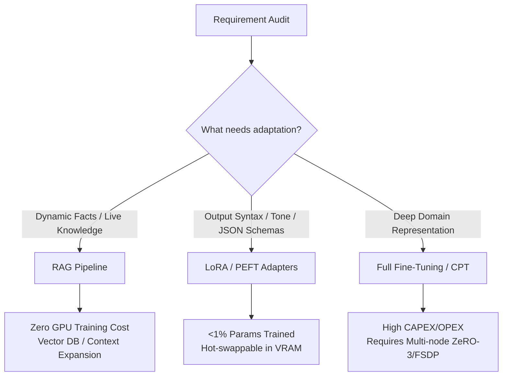
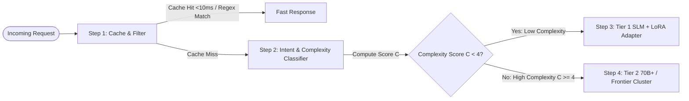

# AI Infrastructure Solutions Architecture
### Systems Architecture, Compute Economics, and Governance

[](AI-Infrastructure-Solutions-Architecture.pdf)
[](#author--citation)
[](#-table-of-contents)

> **Author:** Gustav Keller  
> *Independent AI Infrastructure Researcher — Stockholm, Sweden*

---

## Abstract

This repository contains the technical blueprint and whitepaper on enterprise-level AI infrastructure and inference engineering. It establishes end-to-end blueprints addressing:
- **Hardware Memory Mechanics:** Prefill (TFLOPS-bound) vs. Decode (I/O & memory bandwidth-bound) execution.
- **Interconnect Topologies:** Intra-node (NVLink/NVSwitch) vs. Inter-node (InfiniBand RDMA, RoCEv2, Spectrum X).
- **Accelerator Selection:** Architectural evolution from NVIDIA Ampere (A100) $\rightarrow$ Hopper (H100/H200) $\rightarrow$ Blackwell (B200/B300) $\rightarrow$ Rubin (HBM4/NVFP4).
- **Model Customization & Selection Matrix:** Avoiding the "Frontier Tax", comparing RAG vs. LoRA vs. Full Fine-Tuning (FFT), and deploying a 4-stage cascading escalation model router.
- **Inference Orchestration & Economics:** PagedAttention, FP8 Transformer Engine, FP4 precision, GIL-free native runtimes (Truespar Paddock, vLLM, TensorRT-LLM), and memory layering stack over NVIDIA MPS / Run:ai.
- **Stakeholder Alignment:** Translating technical constraints for Data Science, MLOps/DevOps, and Executive leadership.

---

## 📄 Repository Files

* [`README.md`](README.md) — Comprehensive technical reference guide and documentation.
* [`AI-Infrastructure-Solutions-Architecture.pdf`](AI-Infrastructure-Solutions-Architecture.pdf) — Complete whitepaper publication (11 pages).

---

## Table of Contents

1. [Chapter 1: Hardware Fabric & Sovereign Compute](#-chapter-1-hardware-fabric--sovereign-compute)
   - 1.1 GPU Memory Mechanics: Prefill vs. Decode Bottlenecks
   - 1.2 Interconnect Topologies: Multi-Node & Intra-Node Networks
   - 1.3 Accelerator Selection Strategy (A100 $\rightarrow$ H100/H200 $\rightarrow$ Blackwell $\rightarrow$ Rubin)
   - 1.4 Sovereign Infrastructure & Governance (Data Safety & D2C Liquid Cooling)
   - 1.5 GPU Virtualization & Dynamic Partitioning (MIG vs. MPS / Run:ai)
2. [Chapter 2: The Model Customization & Selection Matrix](#-chapter-2-the-model-customization--selection-matrix)
   - 2.1 Model Sizing Strategy & The "Frontier Tax"
   - 2.2 The Customization Triad: RAG vs. LoRA vs. Full Fine-Tuning
   - 2.3 Core Decision Rules & 4-Stage Cascading Model Router
   - 2.4 Enterprise Architectural Reference Matrix (5 Real-World Scenarios)
3. [Chapter 3: Serving, Quantization, & Inference Efficiency](#-chapter-3-serving-quantization--inference-efficiency)
   - 3.1 Compression & Quantization Mechanics (FP16 $\rightarrow$ FP8 $\rightarrow$ INT4 $\rightarrow$ FP4)
   - 3.2 Inference Orchestration Engine Landscape (vLLM, TensorRT-LLM, Truespar Paddock)
   - 3.3 Unit Economics & Memory Layering (PagedAttention inside MPS)
4. [Chapter 4: Bridging to Teams](#-chapter-4-bridging-to-teams)
   - 4.1 Stakeholder Translation & Alignment Matrix
5. [Author & Citation](#-author--citation)
6. [License](#-license)

---

## Chapter 1: Hardware Fabric & Sovereign Compute

### 1.1 Prefill vs. Decode Execution Mechanics
LLM autoregressive inference operates in two distinct phases:

| Phase | Execution Nature | Primary Bottleneck | Primary Hardware Sizing Target | Key Mitigations |
| :--- | :--- | :--- | :--- | :--- |
| **Prefill Phase** | Parallel (all prompt tokens known) | Arithmetic Compute Throughput (**TFLOPS**) | High compute GPUs (H100/Blackwell) reduce TTFT | Chunked prefill |
| **Decode Phase** | Sequential (autoregressive token loop) | Memory Bandwidth (**I/O**) | HBM Bandwidth & KV-Cache capacity | Speculative decoding, PagedAttention |

### 1.2 Interconnect Topologies
* **Intra-Node (Mesh):** **NVLink / NVSwitch** provides direct GPU-to-GPU mesh interconnects. Essential for **Tensor Parallelism (TP)** to eliminate latency overhead caused by the PCIe bus.
* **Inter-Node (Rack-to-Rack):**
  * **InfiniBand:** Native RDMA ultra-low deterministic latency; gold standard for multi-node Pipeline Parallelism (PP).
  * **RoCEv2:** Cost-effective Ethernet alternative requiring strict Priority Flow Control (PFC) to prevent loss. Managed via hardware/software solutions like **Spectrum X** to handle wire-speed packet reassembly without Head-of-Line (HoL) blocking or PFC deadlocks.

### 1.3 Accelerator Selection Reference Matrix

| Architecture | Key Specifications & Innovations | Ideal Workloads & Use Cases |
| :--- | :--- | :--- |
| **A100 (Ampere)** | FP16/INT8, PCIe Gen4/NVLink | Offline batch inference, mid-tier fine-tuning (7B–14B), embeddings, legacy pipelines. |
| **H100/H200 (Hopper)** | Native FP8 Transformer Engine, H200 high VRAM capacity | Production FP8 inference serving, 70B parameter models on single nodes (avoiding TP overhead). |
| **B200/B300 (Blackwell)** | Native NVFP4, high HBM bandwidth | Heavy real-time generation, massive Mixture of Experts (MoE), agentic reasoning (GB300). |
| **Rubin (Future Gen)** | HBM4 memory (22 TB/s per GPU), 50 PFLOPS NVFP4 | High-density multi-step agentic AI reasoning with zero memory bottleneck. |

### 1.4 Sovereign Infrastructure & Direct-to-Chip (D2C) Liquid Cooling
* **Data Safety:** Sovereign on-prem cloud keeps model weights and KV caches within local legal jurisdictions (complying with EU AI Act, GDPR, US Cloud Act).
* **Thermal Management:** Modern high-density AI cluster racks consume **120–140 kW per rack** (vs. 5–15 kW standard IT racks). Air cooling fails; requires **Direct-to-Chip (D2C) liquid cold plates** circulating coolant mixture (Water/PG25) directly over GPU, CPU, and switch ASIC dies.

### 1.5 GPU Virtualization: MIG vs. MPS / Run:ai
```
┌─────────────────────────────────────────────────────────────┐
│                 NVIDIA MIG (Hardware Slicing)               │
├──────────────────────────────┬──────────────────────────────┤
│ Slice A (Physical Silicon)   │ Slice B (Physical Silicon)   │
│ Cores | Crossbar | Memory    │ Cores | Crossbar | Memory    │
│ (Hard Fault Isolation)       │ (Static, Locked VRAM)        │
└──────────────────────────────┴──────────────────────────────┘

┌─────────────────────────────────────────────────────────────┐
│          NVIDIA MPS / Run:ai (User-Space Interception)       │
├─────────────────────────────────────────────────────────────┤
│ Intercepts CUDA Driver API Calls                            │
│ Multiplexes Linux processes into shared CUDA Context        │
│ Dynamic Time-Slicing & Fractional Quotas (5-10 services/GPU) │
└─────────────────────────────────────────────────────────────┘
```

---

## Chapter 2: The Model Customization & Selection Matrix

### 2.1 The Customization Triad



### 2.2 The 4-Stage Cascading Escalation Model Router

Direct ingestion of queries into 70B+ or Frontier models incurs an unsustainable **"Frontier Tax"**. The gateway enforces a 4-stage escalation stair:



### 2.3 Enterprise Reference Scenarios

1. **Legal & Compliance:** **RAG Pipeline** (Decouples non-parametric regulatory knowledge from model weights).
2. **Structured Medical Coding:** **3B SLM + LoRA Adapter** (Enforces strict JSON schema extraction at >90% cost reduction).
3. **Multi-Brand Customer Support:** **Hybrid RAG + Multi-LoRA** (RAG fetches live user account data; hot-swappable LoRA applies brand voice).
4. **Offline Field Diagnostics:** **Quantized 4-bit SLM** (Deployed on low-power handheld hardware via native runtimes like Paddock or llama).
5. **Complex Coding Agent:** **Frontier API / 70B+ MoE** (Unbounded multi-step logical reasoning).

---

## Chapter 3: Serving, Quantization, & Inference Efficiency

### 3.1 Precision Hierarchy
* **FP16 / BF16 Baseline:** 16 bits/weight. Zero perplexity loss, but saturates memory bandwidth.
* **FP8 Native Transformer Engine:** 8 bits/weight (E4M3 for weights/activations, E5M2 for scaling). 50% VRAM reduction with minimal loss; production default for Hopper/Blackwell.
* **INT4 / AWQ / GPTQ:** 4 bits/weight (4x compression). Allows 70B model to run on single 80GB GPU with a 5-10% trade-off in deep logic/math.
* **FP4 / NVFP4:** Native 4-bit floating point on Blackwell architectures, doubling compute throughput over FP8.

### 3.2 Inference Orchestration Stack & Memory Layering

```
┌─────────────────────────────────────────────────────────────┐
│                 LLM Application Layer                       │
│     vLLM / TensorRT-LLM / Truespar Paddock (GIL-Free)       │
├─────────────────────────────────────────────────────────────┤
│         PagedAttention (LLM Kernel / Memory Paging)         │
│     Allocates non-contiguous KV-cache memory blocks         │
│     Holds 3-5x more user sessions (~70% cost reduction)     │
├─────────────────────────────────────────────────────────────┤
│             NVIDIA MPS / Run:ai (OS / Driver Layer)         │
│     Multiplexes CUDA driver calls & slices physical GPU     │
└─────────────────────────────────────────────────────────────┘
```

---

## Chapter 4: Bridging to Teams

| Stakeholder Persona | Key Technical Priorities | Communication Rhetoric & Deliverables |
| :--- | :--- | :--- |
| **Data Science & Engineering** | Model accuracy, context length scaling, low TTFT, rapid prototyping. | Frame constraints around VRAM ceilings, context window memory limits, and engine hyperparameters. |
| **DevOps & MLOps Infra** | Cluster health, NVLink bus saturation, VRAM utilization, compute times. | Provide Kubernetes manifests, Run:ai fractional quotas, vLLM/PagedAttention configs, auto-scaling thresholds. |
| **Exec & Business Leadership** | Cost per 1M tokens, latency SLAs, regulatory compliance (GDPR, EU AI Act). | Translate GPU usage into unit cost metrics, token profit margins, and legal risk mitigations. |

---

## Author & Citation

**Gustav Keller**  
Independent AI Infrastructure Researcher — Stockholm, Sweden  

```bibtex
@whitepaper{keller2026aiinfra,
  author = {Keller, Gustav},
  title = {AI Infrastructure Solutions Architecture: Systems Architecture, Compute Economics, and Governance},
  year = {2026},
  institution = {Independent AI Infrastructure Research},
  location = {Stockholm, Sweden},
  url = {https://github.com/gurrakeller/AI-Infrastructure-Solutions-Architecture}
}


This project and whitepaper are licensed under the MIT License - see the [LICENSE](LICENSE) file for details.
