<p align="center">
  
</p>

<h1 align="center">SASS King</h1>

<p align="center">
  <strong>Reverse engineering NVIDIA SASS from controlled kernels to production audits.</strong>
</p>

<p align="center">
  <a href="https://florianmattana.com/posts/sass_king/">Article 1</a> ·
  <a href="https://florianmattana.com/posts/sass-king-part-2-reading-the-compiler-mind/">Article 2</a> ·
  <a href="knowledge/README.md">Knowledge base</a> ·
  <a href="patterns/README.md">Pattern library</a> ·
  <a href="knowledge/SASS_INSTRUCTIONS_SM120.md">SM120 instruction glossary</a> ·
  <a href="knowledge/encoding/README.md">Encoding notes</a> ·
  <a href="docs/START_HERE.md">Start here</a> ·
  <a href="docs/PROJECT_STRUCTURE.md">Project structure</a> ·
  <a href="corpus/tensor_cores/README.md">Tensor-core chapters</a> ·
  <a href="CONTRIBUTING.md">Contributing</a>
</p>

<p align="center">
  
  
  
</p>

SASS King is a systematic reverse-engineering project for NVIDIA SASS, the native GPU instruction set emitted inside compiled CUDA binaries. The project starts with SM120 / SM120a consumer Blackwell hardware and expands toward a full cross-architecture ISA and pattern library over time.

The goal is practical: help a kernel engineer open a SASS dump, recognize compiler patterns, identify performance-relevant structures, and connect the binary back to source-level optimization decisions.

The project has completed its initial Phase 3 pattern library: 29 reusable SASS signatures are now formalized under `patterns/`, with `knowledge/FINDINGS.md` kept as the full evidence trail. The next major step is Phase 4: applying those patterns to real production kernels.

## Quick Navigation

| If you want to... | Start here | Then read |
|---|---|---|
| Understand the project in 10 minutes | `docs/README.md` | `docs/START_HERE.md`, then `docs/PROJECT_STRUCTURE.md` |
| Reproduce the evidence | `corpus/README.md` | one chapter `conclusion*.md`, then its `.sass` dump |
| Find the source of truth | `knowledge/FINDINGS.md` | `knowledge/SASS_INSTRUCTIONS_SM120.md`, `knowledge/encoding/README.md` |
| Recognize a pattern in a new dump | `patterns/README.md` | the matching `patterns/NN-*.md` page |
| Start a production audit | `production/README.md` | matching `PATTERN-NN` pages and source evidence |
| Contribute a correction or dump | `CONTRIBUTING.md` | `docs/START_HERE.md` |

The repository is organized as an evidence pipeline:

```text
corpus/      controlled kernels and raw SASS evidence
knowledge/   project-wide findings, instruction notes, and encoding notes
patterns/    reusable Phase 3 audit signatures
production/  Phase 4 real-kernel audits
```

## Why It Exists

The last broad public SASS reverse-engineering work comparable in spirit was Jia et al. on Volta and Turing in 2018. Ampere, Hopper, and Blackwell have changed the instruction mix substantially: async copy paths, tensor-core families, matrix load/store instructions, sparse and scaled MMA forms, and new uniform-register flows.

SASS King fills that gap by combining controlled micro-kernels, raw SASS reading, runtime probes, and production-kernel audits.

## Current State

| Area | Status | Where |
|---|---|---|
| SM120 teaching kernels | Complete through kernels 01-12 | `corpus/basics/01_vector_add/` to `corpus/math_and_spills/12_register_spill/` |
| Tensor-core studies | Complete through Kernel 25 | `corpus/tensor_cores/` |
| Global findings | Active source of truth | `knowledge/FINDINGS.md` |
| SM120 instruction glossary | Active, evidence-backed | `knowledge/SASS_INSTRUCTIONS_SM120.md` |
| Encoding pilots | Started with `LDSM`, `STSM`, `QMMA` | `knowledge/encoding/` |
| denvdis cross-validation | Initial pass complete; deeper control-code gaps remain | `knowledge/DENVDIS_INTEGRATION.md` |
| Pattern library | Initial Phase 3 library complete | `patterns/` |
| Production audits | Next phase | `production/` |

## Phase 3 Deliverable

The formal pattern library is the main output of Phase 3. It turns the chapter-local evidence into reusable audit signatures, so an audit can cite a named pattern instead of rewriting the full research trail every time.

Phase 3 is considered complete because:

- the repeated structures found in chapters 01-25 have been promoted into 29 named pattern pages;
- every pattern has a plain-English explanation, SASS signature, variants, anti-patterns, open gaps, and confidence level;
- claim tags remain bounded to the source evidence in `knowledge/FINDINGS.md`;
- audit-facing navigation now starts from `patterns/README.md`;
- unresolved items are explicitly carried forward as gaps instead of being hidden inside the pattern text.

| Pattern family | Examples | Where |
|---|---|---|
| Tensor-core compute | HMMA, QMMA, OMMA accumulator chains; sparse metadata; narrow fragments | `patterns/02-*` to `patterns/04-*`, `patterns/10-*`, `patterns/21-*` |
| Matrix memory and epilogues | LDSM, STSM, async copy pipelines, REDG reduction epilogues | `patterns/05-*`, `patterns/06-*`, `patterns/07-*`, `patterns/28-*` |
| Control flow | divergence/reconvergence, loop back-edges, predicated exits, cold traps, local CALLs | `patterns/08-*`, `patterns/14-*`, `patterns/16-*`, `patterns/26-*`, `patterns/29-*` |
| Memory and registers | vectorized global memory, spills, shared-memory staging, descriptors, uniform-register flow | `patterns/09-*`, `patterns/11-*`, `patterns/17-*`, `patterns/19-*`, `patterns/20-*` |
| Arithmetic and scheduling | FFMA fusion, constants, MUFU slowpaths, scoreboards, lifetime recycling | `patterns/12-*`, `patterns/18-*`, `patterns/22-*`, `patterns/23-*`, `patterns/24-*` |
| Warp collectives | warp reductions, shuffle/vote/match/sync primitives | `patterns/01-*`, `patterns/25-*` |

Each pattern page includes:

- plain-English meaning;
- SASS signature;
- observed variants;
- interpretation boundaries;
- anti-patterns;
- open gaps;
- confidence level.

Use `patterns/README.md` as the audit-facing index. Use `knowledge/FINDINGS.md` when you need the longer research context behind a pattern.

Phase 3 does not claim that every NVIDIA SASS behavior is decoded. It establishes a reusable SM120 / SM120a pattern layer good enough to begin manual production audits. Runtime layout decode, full control-code bit placement, automated cubin reporting, and cross-architecture replay remain future work.

## Start Here

- New to the project: read [Start Here](docs/START_HERE.md).
- Want the project-wide map: read the [knowledge base index](knowledge/README.md).
- Want the current instruction map: read [SASS instructions on SM120 / SM120a](knowledge/SASS_INSTRUCTIONS_SM120.md).
- Want encoding notes: read [encoding notes](knowledge/encoding/README.md).
- Want the raw source of truth: read [findings](knowledge/FINDINGS.md).
- Want reusable audit signatures: read the [pattern library](patterns/README.md).
- Want tensor-core evidence: start with [tensor-core chapters](corpus/tensor_cores/README.md).
- Want to contribute dumps or corrections: read [contributing](CONTRIBUTING.md).
- Want the v0.1 boundary: read [release notes](RELEASE_NOTES.md).

Public writeups:

- [Part 1 - Reading NVIDIA SASS from First Principles](https://florianmattana.com/posts/sass_king/)
- [Part 2 - Reading the Compiler's Mind](https://florianmattana.com/posts/sass-king-part-2-reading-the-compiler-mind/)

## Methodology

**Controlled variation.** Two kernels differ by exactly one variable: dtype, operand order, unroll factor, memory layout, or compilation target. The SASS diff isolates the compiler decision.

**Strict claim tags.** Every technical claim uses a tag:

| Tag | Meaning |
|---|---|
| `[OBS]` | Directly observed in a dump, log, runtime output, or profile. |
| `[INF]` | Inferred from observed evidence. |
| `[HYP]` | Plausible but not confirmed. |
| `[RES]` | A prior hypothesis resolved by later evidence. |
| `[GAP]` | Open question documented explicitly. |

**Top-down and bottom-up together.** Micro-kernels isolate individual instructions and compiler decisions. Production-like kernels show which patterns matter in real code.

**Pattern-first audits.** A production audit should cite a formal `PATTERN-NN` page only after matching the visible SASS signature and carrying over its confidence limits, anti-patterns, and open gaps.

## What Is Covered

The first pass focuses on the SM120 tensor-core and memory pipeline:

- `HMMA`, `QMMA`, `OMMA`
- `LDSM`, `STSM`
- `LDGSTS`, `LDGDEPBAR`, `DEPBAR`
- `LDG`, `STG`, `LDS`, `STS`, `REDG`
- `BRA`, `EXIT`, `BSSY`, `BSYNC`, `WARPSYNC`
- `SHFL`, `VOTE`, `REDUX`
- uniform-register flow: `S2UR`, `R2UR`, `UMOV`, `ULEA`, `LDCU`

The project does not pretend the ISA is complete yet. The public glossary tracks what is observed and explained; deeper pages under `knowledge/encoding/` track families with enough evidence for matcher-style documentation.

SASS King does not compete with bit-level SASS disassemblers. The project uses local dumps as primary evidence and may use `redplait/denvdis` as a cross-check for instruction fields, scheduling tables, predicates, and register tracking. denvdis can validate low-level encoding interpretations; SASS King owns the controlled-variation evidence, semantic pattern layer, and production-audit interpretation.

## Roadmap

```mermaid
flowchart LR
    P1["Phase 1<br/>Teaching kernels<br/>01-12"] --> P2["Phase 2<br/>SM120 tensor-core corpus<br/>13-25"]
    P2 --> P25["Phase 2.5<br/>denvdis cross-validation<br/>bit-level backend"]
    P25 --> P3["Phase 3<br/>Pattern library<br/>compiler signatures"]
    P3 --> P4["Phase 4<br/>Production audits<br/>real kernels"]
    P4 --> P5["Phase 5<br/>Audit tool<br/>cubin reports"]
    P5 --> P6["Phase 6<br/>Cross-architecture replay<br/>SM80/86/89/90a/100a/120"]

    classDef done fill:#0b6d55,color:#fff,stroke:#0b6d55;
    classDef active fill:#f4c95d,color:#111,stroke:#b89422;
    classDef planned fill:#1f2937,color:#fff,stroke:#6b7280;
    class P1,P2,P25,P3 done;
    class P4 active;
    class P5,P6 planned;
```



| Phase | Status | Output | Why it matters |
|---|---|---|---|
| 1. Teaching kernels | Done | `corpus/basics/`, `corpus/warp_collectives/`, `corpus/math_and_spills/` | Establishes the reading vocabulary from controlled CUDA-to-SASS experiments. |
| 2. SM120 tensor-core corpus | Done | `corpus/tensor_cores/13_hmma_fp16/` to `25_stsm_epilogue/` | Captures the first SM120 / SM120a tensor-core, matrix-memory, control-flow, and epilogue evidence set. |
| 2.5. denvdis cross-validation | Initial pass complete | `knowledge/DENVDIS_INTEGRATION.md`, `knowledge/encoding/CONTROL_CODE.md` | Uses denvdis as a bit-level cross-check without replacing local dump evidence. Full stall/yield bit placement remains open. |
| 3. Pattern library | Initial library complete | `patterns/` | Turns repeated compiler/SASS structures into reusable signatures. |
| 4. Production audits | Next | `production/` | Tests whether corpus patterns explain real kernels from production libraries. |
| 5. Audit tool | Planned | cubin-to-report pipeline | Makes the pattern layer scriptable and repeatable. |
| 6. Cross-architecture replay | Planned | SM80, SM86, SM89, SM90a, SM100a, SM120 comparisons | Separates architecture-specific facts from general NVIDIA SASS behavior. |

### Phase 1 - Teaching Kernels

Kernels 01-12 establish baseline SASS concepts: FMA fusion, scoreboard behavior, loop lowering, shared memory, global memory, warp primitives, slow-path math, and local-memory spills.

### Phase 2 - Tensor-Core And SM120 Coverage

Kernels 13-25 cover the current SM120 tensor-core path:

| Kernel | Topic |
|---|---|
| 13 | HMMA baseline, register allocation, accumulator chaining |
| 14 | QMMA FP8 / FP6 / FP4 baseline |
| 15 | Narrow MMA variants |
| 16 | FP4 peak and block-scaled OMMA/QMMA |
| 17 | LDSM and matrix-load behavior |
| 18 | Pipelined MMA tile and async copy staging |
| 19 | Sparse MMA metadata |
| 20 | Control flow and back-edge detection |
| 21 | Divergence and reconvergence |
| 22 | STSM matrix-store behavior |
| 23 | FP4 / FP6 fragment layout probes |
| 24 | Production mini-GEMM audit |
| 25 | STSM epilogue layout and storeback semantics |

### Phase 2.5 - denvdis Cross-Validation

Validate `redplait/denvdis` as the bit-level cross-check backend for SM120 / SM120a before production audits depend on the pattern library. The pass runs `nvd -O`, `nvd -S`, `nvd -p`, and where useful `nvd -T` on representative local cubins or dumps covering `HMMA`, `QMMA`, `QMMA.SF`, `QMMA.SP`, `OMMA`, `LDSM`, `STSM` b16/b8, `LDGSTS`, `DEPBAR`, and divergence markers.

The output is `knowledge/DENVDIS_INTEGRATION.md`: a factual compatibility table from family to denvdis recognition status, modifier coverage, exposed control-code fields, and the SASS King action. denvdis output is supporting evidence, not a replacement for local dump observations.

### Phase 3 - Pattern Library

Formalized recurring structures into reusable signatures:

- `LDGSTS -> DEPBAR -> LDSM -> MMA`
- chained `HMMA` / `QMMA` / `OMMA`
- `STSM -> BAR -> LDS -> STG`
- warp reductions and cross-lane collectives
- register-spill signatures
- scalar and uniform control-flow patterns

The initial Phase 3 library contains 29 pattern pages under `patterns/`. `knowledge/FINDINGS.md` remains the research log and source of truth; `patterns/` is the audit-facing entry point.

Phase 3 is complete at the initial library level. Remaining items such as runtime layout decode, full control-code bit placement, and cross-architecture replay are tracked as gaps or future phases, not blockers for starting Phase 4 production audits.

### Phase 4 - Production Audits

Apply the pattern library to real kernels from libraries such as FlashAttention, CUTLASS, xFormers, Transformer Engine, FlashInfer, llama.cpp / ggml, tinygrad, and related projects. The goal is representative coverage by algorithmic pattern, not one markdown file per kernel.

The first Phase 4 deliverable should be a manual audit report that:

- segments one real kernel into SASS regions;
- cites matching `PATTERN-NN` pages;
- assigns confidence levels to each conclusion;
- records unexplained regions as new gaps;
- avoids building an audit tool until at least one manual report is stable.

### Phase 5 - Audit Tool

Build a pipeline that takes a cubin, detects known patterns, and emits an optimization-oriented report.

### Phase 6 - Cross-Architecture

Replay the methodology on additional targets:

| Arch | Representative GPU | Why |
|---|---|---|
| SM80 | A100 | Datacenter Ampere baseline |
| SM86 | RTX 3090 | Consumer Ampere corpus |
| SM89 | RTX 4090 | Common consumer inference card |
| SM90a | H100 | TMA, WGMMA, warp specialization, clusters |
| SM100a | B200 | tcgen05.mma, TMEM |
| SM120 | RTX 5070 Ti / 5090 | Consumer Blackwell starting point |

## Repository Map

```text
.
├── corpus/                                # Controlled kernels, dumps, and chapter writeups
│   ├── basics/                            # Kernels 01-08: scalar/vector and memory basics
│   ├── warp_collectives/                  # Kernels 09-10: shuffle, vote, reduction
│   ├── math_and_spills/                   # Kernels 11-12: slow paths and spills
│   └── tensor_cores/                      # Kernels 13-25: tensor-core studies
├── knowledge/                              # Findings, glossary, encoding notes
│   ├── FINDINGS.md
│   ├── SASS_INSTRUCTIONS_SM120.md
│   └── encoding/
├── patterns/                               # Formal Phase 3 pattern library
├── production/                             # Phase 4 production-kernel audits
├── docs/                                   # Onboarding, structure, and release-facing notes
└── guide/                                  # External SASS reading guide submodule
```

Each chapter folder contains source kernels, compiled artifacts when relevant, SASS dumps when they are part of the validated evidence set, and a `conclusion<N>.md` writeup.

For a fuller explanation of what belongs in each directory, read [Project Structure](docs/PROJECT_STRUCTURE.md).

## Tooling

- `cuobjdump --dump-sass` for raw disassembly.
- `gpuasm.com` for scoreboards, stalls, pressure, and dependency arrows.
- Nsight Compute for profiling and stall attribution.
- `%clock` microbenchmarks for instruction latency probes.
- `nvcc -Xptxas -v` for register and spill metadata.

## Related Work

- [Jia et al. 2018, "Dissecting the NVIDIA Volta GPU Architecture via Microbenchmarking"](https://arxiv.org/abs/1804.06826) for the empirical microbenchmarking discipline behind latency, throughput, and dependency validation.
- [kuterdinel.com/nv_isa](https://kuterdinel.com/nv_isa/) for fuzzed NVIDIA ISA encoding work, especially the idea of deriving machine-readable encoding rules from disassembler behavior.
- [redplait/denvdis](https://github.com/redplait/denvdis) for opcode tables, bit-level disassembly, encoding-field inspection, scheduling analysis, register tracking, and cubin manipulation. The extracted [SM120 data12 tables](https://github.com/redplait/denvdis/tree/master/data12) are used as a low-level cross-check while local dumps remain primary evidence.
- Redplait tooling and notes: [ced cubin editor](https://redplait.blogspot.com/2025/07/ced-sed-like-cubin-editor.html), [SASS disassembly Perl bindings](https://redplait.blogspot.com/2025/10/sass-disasm-on-perl.html), [SASS latency analysis](https://redplait.blogspot.com/2026/04/sass-latency-analysis.html), and [libcuda/nvasm_internal notes](https://redplait.blogspot.com/2025/12/libcudaso-internals.html).
- [Huerta et al. 2025](https://arxiv.org/abs/2503.20481) for reverse-engineering compiler-guided scheduling, control codes, dependency counters, reuse flags, and yield behavior.
- [Yan et al. 2026](https://arxiv.org/abs/2604.26889) for the driver-layer launch and pushbuffer analysis below SASS.
- [MaxAS](https://github.com/NervanaSystems/maxas) and [TuringAS](https://github.com/daadaada/turingas) as prior public SASS assembler efforts for older NVIDIA architectures.
- NVIDIA [CUDA Binary Utilities](https://docs.nvidia.com/cuda/cuda-binary-utilities/) documentation for official cubin, fatbin, and disassembly tooling.

SASS King operates at the algorithmic pattern layer: recognizing how compiled kernels are structured and connecting those structures to source-level optimization decisions.

## Contributing

Contributions are welcome, especially:

- raw SASS dumps from hardware not directly available here;
- controlled kernel studies that isolate one compiler decision;
- corrections to existing observations;
- new production-kernel pattern proposals;
- cross-architecture comparisons.

See [CONTRIBUTING.md](CONTRIBUTING.md) for the expected metadata and writing standard.

## Author

Florian Mattana. [florianmattana.com](https://florianmattana.com)
